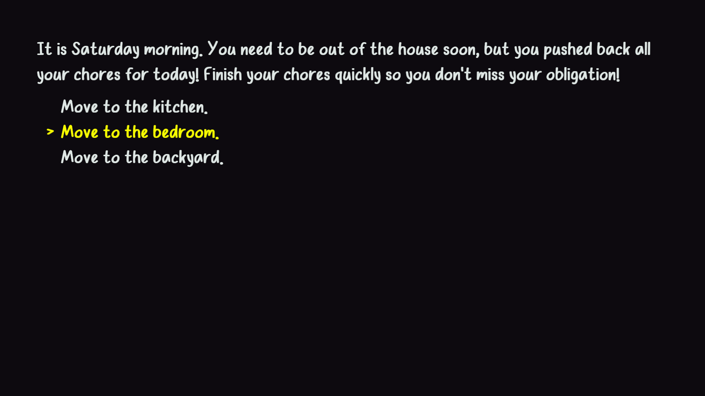

# Choremaster

### Author: Matthew Largo

### A text-based, choice-based, chore simulator where you procrastinated on your chores all week and must get them done before you obligations later today, but you can only do so many things at once with two hands.

Text Drawing: The use creates a FontRast object to manage a font face, which it loads and shapes using freetype and harfbuzz. Glyphs information corresponding to individual characters are queried via freetype (we do not handle special glyphs), and are drawn to a single texture side by side using OpenGL's sub texture function. The texture coordinates for each individual character are stored in mapping from its writeable character to the corresponding coordinates. Then, rendering text simply creates the vertices necessary for each character, whose positions are determined by harfbuzz, and assigns the texture coordinates via a lookup. Whitespace characters are handled independently, using freetype's determination of line spacing.

Choices: The game stores choices and narratives in a text file. They are authored in the same place. The structure of the narrative is defined in chunks, which the game reads as nodes to a story graph. Each chunk or node is given a name, identified by the '@' character; the text or script of a node is identified by the '%' character; and choices are identified by the '$' character.

A choice requires three fields, separated by the pipe '|' character.
The text immediately following the choice identifier "$choice=" up until the first pipe is take as the choice text, or what the player reads. Between the two pipes, one can specify any number of conditions for this choice to be rendered using the keyword "show if" and comparison operations "=", ">", "<" or actions "add", "sub", or "set" to perform on variables if this choice is selected (all the specified conditions must be true to render a choice, and all actions are performed if chosen). The remaining text after the second pipe must be name of a defined node, which will be transitioned to if the choice is selected. Nodes may be defined in any order to allow for cyclic story-telling. 

Variables are defined at the beginning of the text file between "begindef" and "enddef" keywords. Variables of type "int", "string", and "bool" are supported.

## How To Play:

### Controls:

W/S or UP/DOWN ARRROW - Switch between choices

ENTER / SPACE - Select a choice

Q - Quit

R - Restart

ESCAPE - Ungrab the mouse

### Objective:

You procrastinated all week and let your chores pile up until the weekened. You don't exactly remember what it is you have to do, but you may remember if you pace around the house a bit. You also have an obligaion later today, so you must get them all done before then! Unfortunately, you only have two hands, and can only do so many things at once.

Sources: [windsol.ttf](https://www.dafont.com/windsol.font) - Free for personal use.

This game was built with [NEST](NEST.md).

